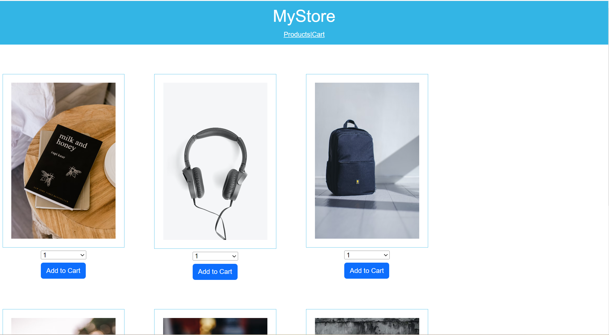
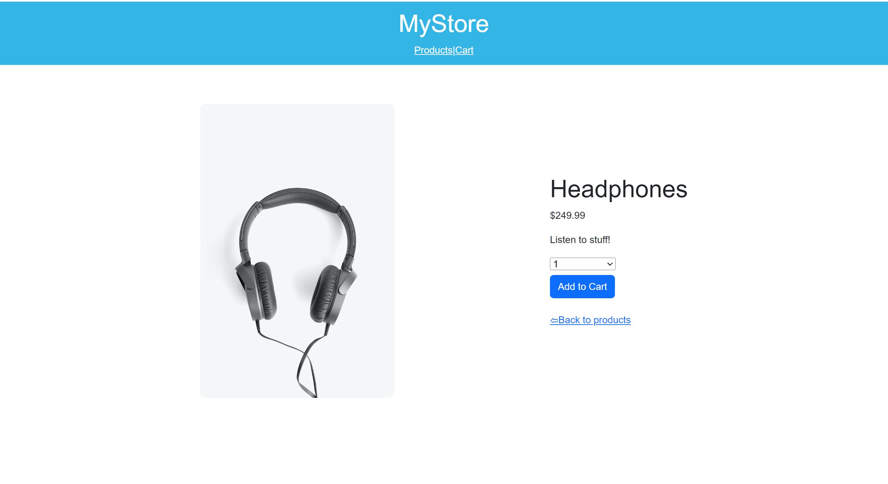
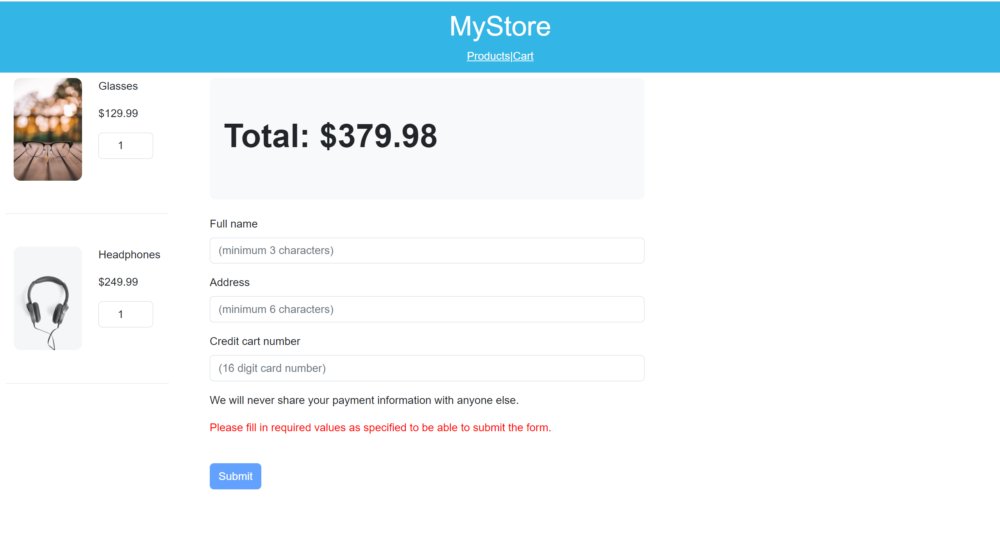
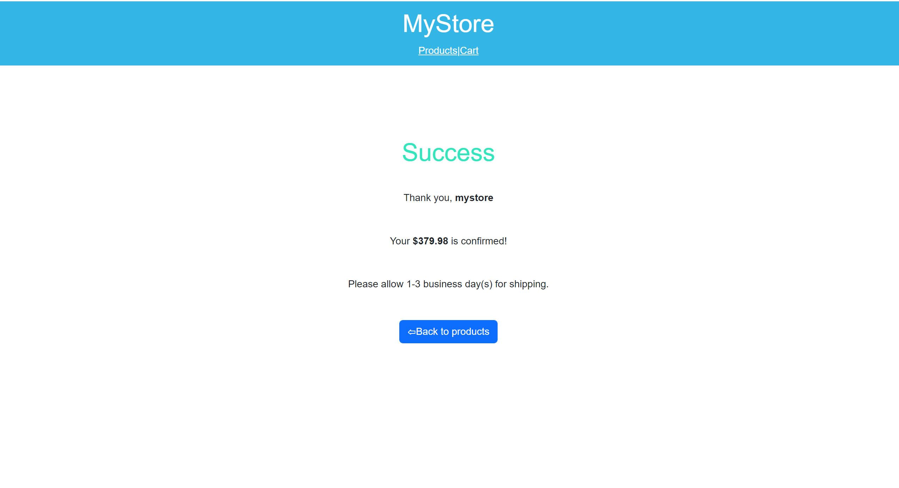

# MystoreApp

MyStore is Angular application that allows users to view a list of available products to purchase, add them to a shopping cart, and ultimately complete the checkout process. 

## Installing the app

* To be able to run the application follow these steps: 

    * `npm install`

## Development server

Run `ng serve` for a dev server. Navigate to `http://localhost:4200/`. The application will automatically reload if you change any of the source files.

## Project Structure

The app has two modules:

* `store module`: 
    * Displays the products with products page and product details page.
* `cart module`: 
    * Displays the cart with cart page and order submitted page.

## Build

Run `ng build` to build the project. The build artifacts will be stored in the `dist/` directory.

## Gallery

This project was generated with [Angular CLI](https://github.com/angular/angular-cli) version 15.0.4.

## Development server

Run `ng serve` for a dev server. Navigate to `http://localhost:4200/`. The application will automatically reload if you change any of the source files.

## Code scaffolding

Run `ng generate component component-name` to generate a new component. You can also use `ng generate directive|pipe|service|class|guard|interface|enum|module`.

## Build

Run `ng build` to build the project. The build artifacts will be stored in the `dist/` directory.

## Running unit tests

Run `ng test` to execute the unit tests via [Karma](https://karma-runner.github.io).

## Running end-to-end tests

Run `ng e2e` to execute the end-to-end tests via a platform of your choice. To use this command, you need to first add a package that implements end-to-end testing capabilities.

## Further help

To get more help on the Angular CLI use `ng help` or go check out the [Angular CLI Overview and Command Reference](https://angular.io/cli) page.
